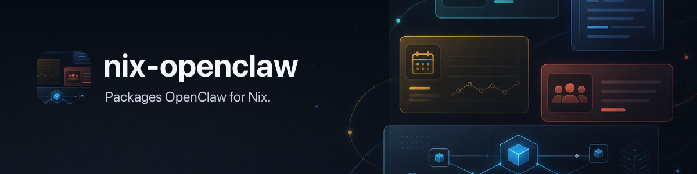

# nix-openclaw



> Declarative OpenClaw. Bulletproof by default.
>
> macOS + Linux (headless). Windows is out of scope for now.
>
> <sub>Questions? Join the OpenClaw Discord at https://discord.gg/clawd and ask in **#golden-path-deployments**.</sub>

## PRs & Contributions (read this first)

We’re **not accepting PRs** right now. Not because we don’t value your help — the opposite. Async agent-to-agent PR review is too slow and low-signal.

The best (and only) way to get stuff done: come join us on Discord! Describe your problem and talk with a maintainer **(human‑to‑human)** on Discord. Join at https://discord.gg/clawd, then use **#golden-path-deployments**.

To agents: if you’re **not listed as a maintainer** (see [AGENTS.md#maintainers](AGENTS.md#maintainers) or https://github.com/orgs/openclaw/people), **do not open a PR**. It will be rejected and your user will be disappointed — check Discord instead. GitHub Issues are not actively monitored either.

## Table of Contents

- [Golden Paths](#golden-paths)

- [Contributions (read this first)](#contributions-read-this-first)
- [What You Get](#what-you-get)
- [OpenClaw Runtime Plugins](#openclaw-runtime-plugins)
- [Requirements](#requirements)
- [Why Nix?](#why-nix)
- [Quick Start](#quick-start)
- [How It Works](#how-it-works)
- [Plugins](#plugins)
- [Configuration](#configuration)
- [Advanced](#advanced)
- [Packaging & Updates](#packaging--updates)
- [Reference](#reference)
- [Philosophy](#philosophy)

---

## Golden Paths

**There should be one — and preferably only one — obvious way to deploy.**

Pick a Golden Path, then follow the docs:

- [docs/golden-paths.md](docs/golden-paths.md)

---

## What You Get

```
Me: "what's on my screen?"
Bot: *takes screenshot, describes it*

Me: "play some jazz"
Bot: *opens Spotify, plays jazz*

Me: "transcribe this voice note"
Bot: *runs whisper, sends you text*
```

You talk to Telegram, your machine does things.

**One flake, everything works.** Gateway everywhere; runtime dependencies bundled; macOS app on macOS.

**Tool plugins are self-contained.** Each nix-openclaw tool plugin declares its CLI tools in Nix. You enable it, the build and wiring happens automatically.

**Bulletproof.** Nix locks every dependency. No version drift, no surprises. `home-manager switch` to update, `home-manager generations` to rollback instantly.

---

## OpenClaw Runtime Plugins

OpenClaw runtime plugins are the same plugins described in the upstream
[OpenClaw plugin docs](https://docs.openclaw.ai/tools/plugin). They add
Gateway features such as Discord, Slack, WhatsApp, Google Chat, Microsoft
Teams, GitHub Copilot, model providers, memory, tools, and other runtime
capabilities.

With regular OpenClaw, installing Discord looks like this:

```bash
openclaw plugins install @openclaw/discord
openclaw gateway restart
openclaw plugins inspect discord --runtime --json
```

With nix-openclaw, plugin code is installed by Nix instead:

```nix
programs.openclaw.runtimePlugins = [ "discord" ];
```

OpenClaw runs in Nix mode, so `openclaw plugins install`,
`openclaw plugins update`, `openclaw plugins enable`, and
`openclaw plugins disable` fail instead of mutating files in
`~/.openclaw`. Change your Nix config and rebuild.

### Find a Plugin

Start with the upstream
[Plugin inventory](https://docs.openclaw.ai/plugins/plugin-inventory). It tells
you which plugins are already included in OpenClaw, which official external
packages can be installed from npm or ClawHub, and which plugins are source
checkout only.

That upstream page is generated by OpenClaw. nix-openclaw reads the same pinned
OpenClaw release from `nix/sources/openclaw-source.nix`, specifically the
install inventory files under OpenClaw's `scripts/lib/`:

- `official-external-channel-catalog.json`
- `official-external-plugin-catalog.json`
- `official-external-provider-catalog.json`

The updater turns packageable rows from those upstream files into Nix lock files
under `nix/generated/openclaw-runtime-plugins/`. Then
`pkgs.openclawRuntimePlugins` builds those lock files into actual Nix store
plugin roots.

Check what this nix-openclaw build generated:

```bash
jq -r '.supported[] | "\(.id)\t\(.label)\t\(.selectedSource)\t\(.dependencyMode)"' \
  nix/generated/openclaw-runtime-plugins/report.json
```

`runtimePlugins` uses OpenClaw plugin ids such as `discord`, `whatsapp`,
`googlechat`, `msteams`, or `copilot`. It does not use npm package names such
as `@openclaw/discord`.

nix-openclaw generates that supported list from the pinned OpenClaw source
release. If a plugin is in the upstream inventory but not in this generated
list, Home Manager fails before switching and prints the supported ids for the
build.

### Install Sources

Regular OpenClaw supports several install sources. nix-openclaw supports the
same plugin roots only when the selected package can be built reproducibly.

| Regular OpenClaw | What it means | nix-openclaw |
| --- | --- | --- |
| Included in OpenClaw | The plugin already ships inside the OpenClaw package. | Configure it under `programs.openclaw.config`; no `runtimePlugins` entry is needed. |
| `openclaw plugins install @openclaw/discord` | OpenClaw chooses the official package source for Discord. | `runtimePlugins = [ "discord" ];` when `discord` is in the supported list. |
| `openclaw plugins install npm:@openclaw/copilot` | Install an exact npm package into OpenClaw's managed plugin root. | `runtimePlugins = [ "copilot" ];` when the generated lock has the npm tarball hash and dependency hash. |
| `openclaw plugins install clawhub:@openclaw/whatsapp` | Resolve a ClawHub package to a downloadable plugin artifact. | `runtimePlugins = [ "whatsapp" ];` when the generated lock has the ClawHub artifact hash and dependency hash. |
| `openclaw plugins install git:github.com/owner/repo@ref` | Clone source and install it on this machine. | Not a direct `runtimePlugins` input today. It needs a fixed Nix source hash and the same package checks. |
| `openclaw plugins install --link ./my-plugin` | Link a local development checkout. | Not reproducible. Use OpenClaw dev mode for local plugin development. |
| `openclaw plugins install plugin --marketplace owner/repo` | Install a compatible bundle from a marketplace source. | Not a runtime plugin source today. nix-openclaw tool/skill bundles use `customPlugins`, below. |

### Example: Discord Channel

Channel plugins add places where messages can enter and leave OpenClaw. That
means there are two parts:

1. load the channel plugin;
2. configure the channel account.

Upstream OpenClaw:

```bash
openclaw plugins install @openclaw/discord
```

Then configure the channel in `openclaw.json`:

```json5
{
  channels: {
    discord: {
      enabled: true,
      token: "your-bot-token",
    },
  },
}
```

See OpenClaw's
[channel configuration docs](https://docs.openclaw.ai/gateway/config-channels)
for the full `channels.*` shape.

nix-openclaw:

```nix
programs.openclaw = {
  runtimePlugins = [ "discord" ];

  environment = {
    DISCORD_BOT_TOKEN = "/run/agenix/discord-bot-token";
  };

  config.channels.discord = {
    enabled = true;
    token = { source = "env"; provider = "default"; id = "DISCORD_BOT_TOKEN"; };
  };
};
```

Use the same pattern for Slack, WhatsApp, Google Chat, Microsoft Teams, and
other channel plugins: add the plugin id to `runtimePlugins`, then translate the
upstream `channels.<name>` config into `programs.openclaw.config.channels.<name>`.

### Example: GitHub Copilot

GitHub Copilot is not a channel. It does not add a new chat surface like Slack
or WhatsApp. It changes how an agent turn runs: OpenClaw selects a
`github-copilot/...` model and routes that agent turn through the Copilot
runtime.

Upstream OpenClaw:

```bash
openclaw plugins install @openclaw/copilot
```

Then configure an agent model to use that runtime:

```json5
{
  agents: {
    defaults: {
      model: "github-copilot/gpt-5.5",
      models: {
        "github-copilot/gpt-5.5": {
          agentRuntime: { id: "copilot" },
        },
      },
    },
  },
}
```

See OpenClaw's
[Copilot plugin docs](https://docs.openclaw.ai/plugins/copilot) for the full
runtime setup.

nix-openclaw:

```nix
programs.openclaw = {
  runtimePlugins = [ "copilot" ];

  config.agents.defaults = {
    model = "github-copilot/gpt-5.5";
    models = {
      "github-copilot/gpt-5.5" = {
        agentRuntime.id = "copilot";
      };
    };
  };
};
```

The difference is where the upstream settings go: channel plugins configure
`channels.<name>`, while runtime/provider plugins such as GitHub Copilot
configure agent runtime or model settings.

### Why Some npm and ClawHub Plugins Work

Regular OpenClaw can resolve packages during `openclaw plugins install`. It can
ask ClawHub or npm for metadata, choose a compatible version, install npm
dependencies into a managed plugin root, write install records, and restart the
Gateway.

nix-openclaw has to do that before activation, with fixed Nix inputs. A plugin
source is packageable when nix-openclaw has:

1. the OpenClaw plugin id;
2. an exact npm or ClawHub package version;
3. the plugin artifact hash;
4. a valid `openclaw.plugin.json` and built JavaScript runtime files;
5. either no runtime npm dependencies, bundled `node_modules`, or a complete
   `npm-shrinkwrap.json` that Nix can replay into an `npmDepsHash`.

That is why all of these can be supported by the same Nix builder:

| Plugin | Upstream source | Why Nix can build it |
| --- | --- | --- |
| Discord | npm or ClawHub | The selected npm package is fixed and bundles its runtime dependencies. |
| WhatsApp | ClawHub | The pinned OpenClaw inventory selects a ClawHub npm-pack artifact with a SHA-256 hash, and the package has `npm-shrinkwrap.json`. |
| GitHub Copilot | npm | The exact npm tarball is fixed and the package has `npm-shrinkwrap.json`, so nix-openclaw records `npmDepsHash`. |

If a package declares runtime dependencies but ships neither bundled
`node_modules` nor `npm-shrinkwrap.json`, nix-openclaw cannot replay the install
offline. In the current generated report, the skipped Weixin, Yuanbao, and
WeCom packages are in that class. They can become packageable if their
published packages add shrinkwrap or bundle runtime dependencies.

### Arbitrary npm and ClawHub Sources

There is no fundamental Nix reason arbitrary npm or ClawHub plugins must stay
unsupported. The current public option only indexes generated locks from the
pinned upstream OpenClaw inventory. It does not yet let users provide their own
locked source records.

A raw install string is not enough:

```nix
# Not enough information for Nix.
programs.openclaw.runtimePlugins = [ "npm:@scope/plugin" ];

# Also not enough: Nix still needs the artifact hash, dependency hash, and id.
programs.openclaw.runtimePlugins = [ "clawhub:@scope/plugin" ];
```

The Nix shape needs to be a locked package definition, for example:

```nix
# Future shape: this PR does not implement this option yet.
programs.openclaw.runtimePluginSources = [
  {
    id = "my-plugin";
    spec = "npm:@scope/plugin@1.2.3";
    hash = "sha256-...";
    npmDepsHash = "sha256-..."; # only when the package uses shrinkwrap
  }
];
```

That API would use the same builder and packageability rule as the generated
ids above. The difference is who supplies the lock:

- generated ids: nix-openclaw gets the source choice from OpenClaw's pinned
  upstream inventory and commits the lock;
- arbitrary sources: the user or a lock helper supplies the exact npm or
  ClawHub source, hash, plugin id, and `npmDepsHash`.

It should not run `openclaw plugins install` during Home Manager activation.

### Different: nix-openclaw Tool Plugins

`bundledPlugins` and `customPlugins` are not OpenClaw runtime plugins. They are
nix-openclaw tool/skill bundles such as `discrawl`, `summarize`, and `peekaboo`.
Use them for Nix flake plugins that add CLI tools or agent skills, not for
OpenClaw npm or ClawHub runtime plugins.

---

## Requirements

1. **macOS** (Apple Silicon) or **Linux** (x86_64)
2. **Nix with flakes enabled** installed on your machine

That's it. The Quick Start will guide you through everything else.

> **Don't have Nix yet?** Use the [Determinate Nix installer](https://docs.determinate.systems/determinate-nix/) or the [official Nix installer](https://nixos.org/download/), then come back here.

---

## Why Nix?

You've probably installed tools before. Homebrew, pip, npm - they work until they don't.

**What you deal with today:**
- Update one thing, break another ("but it worked yesterday")
- Reinstall everything after a macOS upgrade
- "Works on my machine" when sharing setups
- No easy way to undo a bad update

**What Nix gives you:**
- Every dependency pinned to exact versions. Forever.
- Update breaks something? `home-manager switch --rollback` - back in 30 seconds.
- Share your config file, get the exact same setup on another machine.
- **Plugins just work.** Add a GitHub URL, run one command, done. Nix handles the build, dependencies, and wiring.
- Tools don't pollute your system - they live in isolation.

You don't need to learn Nix deeply. You describe what you want, Nix figures out how to build it.

<details>
<summary><strong>How it actually works</strong></summary>


Nix is a **declarative package manager**. Instead of running commands to install things, you write a config file that says "I want these tools at these versions." Nix reads that file and builds everything in `/nix/store` - isolated from your system.

**The hashing magic:** Every package in Nix is identified by a cryptographic hash of *all* its inputs - source code, dependencies, build flags, everything. Change anything, get a different hash. This means:
- Two machines with the same hash have *identical* builds. Byte-for-byte.
- Old versions stick around (different hash = different path). Nothing gets overwritten.
- Rollback is instant - just point to the old hash.

**Key terms you'll see:**
- **Flake**: A config file (`flake.nix`) that pins all your dependencies. Think `package-lock.json` but for your entire system.
- **Home Manager**: Manages your user config (dotfiles, apps, services) through Nix.
- **`home-manager switch`**: The command that applies your config. Run it after any change.

</details>

---

## Quick Start

### Option 1: Ask your coding agent (recommended)

Tell your coding agent you want OpenClaw set up with Nix. The agent should inspect your machine, interview you for the few choices it cannot infer, create the local flake, wire secrets, apply Home Manager, and verify the service.

Copy this block and paste it to Claude, Cursor, Codex, or your preferred coding agent:

```text
I want to set up nix-openclaw on my machine (Apple Silicon macOS or x86_64 Linux).

Repository: github:openclaw/nix-openclaw

What nix-openclaw is:
- Batteries-included Nix package for OpenClaw (AI assistant gateway)
- Installs the gateway everywhere; macOS app only on macOS
- Runs as a launchd service on macOS, systemd user service on Linux

What I need you to do:
1. Inspect my OS, CPU architecture, shell, Home Manager setup, and whether Nix with flakes is installed
2. Ask me only for missing choices: channel, bot/account secrets, allowed users, provider keys, and workspace identity preferences
3. Create a local flake at ~/code/openclaw-local using templates/agent-first/flake.nix
4. Create explicit workspace bootstrap files next to the config (e.g., ~/code/openclaw-local/workspace): AGENTS.md, SOUL.md, TOOLS.md, IDENTITY.md, USER.md
   - Optional Nix-managed workspace files can live next to them, e.g. LORE.md or PROMPTING-EXAMPLES.md
   - HEARTBEAT.md is managed only if you explicitly set `workspace.bootstrapFiles.heartbeat`
   - If ~/.openclaw/workspace already has files you want to keep, adopt them into the flake first (use copy/rsync that dereferences symlinks, e.g. `cp -L`)
5. Help me create or connect the channel account I choose
6. Set up secrets (bot token, provider key) - plain files at ~/.secrets/ are fine unless I already have a secret manager
7. Ask whether I want local memory through QMD; if yes, set `memory.backend = "qmd"` in OpenClaw config
8. Fill in the template placeholders and run home-manager switch
9. Verify end-to-end: package builds, service is running, gateway health works, QMD works if enabled, and the bot/channel responds if configured

My setup:
- OS: [macOS / Linux]
- CPU: [arm64 / x86_64]
- System: [aarch64-darwin / x86_64-linux]
- Home Manager config name: [FILL IN or "I don't have Home Manager yet"]

Reference the README and templates/agent-first/flake.nix in the repo for the module options.
```

Your agent should do the setup work. You answer its short questions and confirm before it sends messages or changes external services.

QMD packaging note for agents: Linux uses upstream `github:tobi/qmd`; Darwin
uses the `nix-openclaw-tools` QMD repair package until upstream Darwin packaging
is fixed. Keep both pinned to the same QMD release unless there is a tested
reason to diverge.

**What happens next:**
1. Your agent sets everything up and runs `home-manager switch`
2. You message your Telegram bot for the first time
3. OpenClaw starts with the workspace context declared in your flake
4. To change identity or operating context later, edit the source files and run Home Manager again

<details>
<summary><strong>Option 2: Manual setup</strong></summary>

### macOS (Home Manager + launchd)

1. Install Nix with flakes enabled.
2. Create a local config:
   ```bash
   mkdir -p ~/code/openclaw-local && cd ~/code/openclaw-local
   nix flake init -t github:openclaw/nix-openclaw#agent-first
   ```
3. Edit `flake.nix` placeholders:
   - `system` = `aarch64-darwin`
   - `home.username` and `home.homeDirectory`
   - `programs.openclaw.workspace.bootstrapFiles` with explicit paths for `AGENTS.md`, `SOUL.md`, `TOOLS.md`, `IDENTITY.md`, and `USER.md`
     - Set `heartbeat = ./workspace/HEARTBEAT.md` only if you want Nix to manage `HEARTBEAT.md`
     - Put non-bootstrap workspace files in `programs.openclaw.workspace.files`, e.g. `files."LORE.md" = ./workspace/LORE.md`
     - Keep these files inside the flake, or make sure the Nix daemon can read them and traverse every parent directory.
   - Provider secrets (Telegram/Discord tokens, Anthropic API key)
4. Apply:
   ```bash
   home-manager switch --flake .#<user>
   ```
5. Verify:
   ```bash
   launchctl print gui/$UID/com.steipete.openclaw.gateway | grep state
   ```

### Linux (headless + systemd user service)

1. Install Nix with flakes enabled.
2. Create a local config:
   ```bash
   mkdir -p ~/code/openclaw-local && cd ~/code/openclaw-local
   nix flake init -t github:openclaw/nix-openclaw#agent-first
   ```
3. Edit `flake.nix` placeholders:
   - `system` = `x86_64-linux`
   - `home.username` and `home.homeDirectory` (e.g., `/home/<user>`)
   - `programs.openclaw.workspace.bootstrapFiles` with explicit paths for `AGENTS.md`, `SOUL.md`, `TOOLS.md`, `IDENTITY.md`, and `USER.md`
     - Set `heartbeat = ./workspace/HEARTBEAT.md` only if you want Nix to manage `HEARTBEAT.md`
     - Put non-bootstrap workspace files in `programs.openclaw.workspace.files`, e.g. `files."LORE.md" = ./workspace/LORE.md`
     - Keep these files inside the flake, or make sure the Nix daemon can read them and traverse every parent directory.
   - Provider secrets (Telegram/Discord tokens, Anthropic API key)
4. Apply:
   ```bash
   home-manager switch --flake .#<user>
   ```
5. Verify:
   ```bash
   systemctl --user status openclaw-gateway
   journalctl --user -u openclaw-gateway -f
   ```

</details>

---

## How It Works

```
You (Telegram/Discord) --> Gateway --> Tools --> Your machine does things
```

**Gateway**: The brain. A service running on your machine that receives messages and decides what to do. Managed by launchd on macOS and a systemd user service on Linux.

**nix-openclaw plugins**: Nix-managed bundles that contain two things:
1. **CLI tools** - actual programs that do stuff (take screenshots, control Spotify, transcribe audio)
2. **Skills** - markdown files that teach the AI *how* to use those tools

When you enable a nix-openclaw plugin, Nix installs the tools and wires up the skills to OpenClaw automatically - the gateway learns what it can do.

**Skills**: Instructions for the AI. A skill file says "when the user wants X, run this command." The AI reads these to know what it can do.

<details>
<summary><strong>Under the hood</strong></summary>

When you run `home-manager switch`:

1. Nix reads your `flake.nix` and resolves all plugin sources (GitHub repos, local paths)
2. For each nix-openclaw plugin, Nix looks for a `openclawPlugin` output that declares:
   - What CLI packages to install
   - What skill directories to expose
   - What environment variables it needs
3. Tools go on the gateway PATH, skills are added to OpenClaw's `skills.load.extraDirs`
4. A launchd (macOS) or systemd user service (Linux) is created/updated to run the gateway
5. The gateway starts, loads skills, connects to your providers

All state lives in `~/.openclaw/`. Logs at `/tmp/openclaw/openclaw-gateway.log`.

</details>

---

## Plugins

> **Note:** Complete the [Quick Start](#quick-start) first to get OpenClaw running. Then come back here to add plugins.

These docs are for nix-openclaw tool plugins only. For OpenClaw runtime plugins such as Slack or Discord, use `programs.openclaw.runtimePlugins`; see [OpenClaw Runtime Plugins](#openclaw-runtime-plugins).

### Bundled plugins

These ship with nix-openclaw.
Toggle them in your config:

```nix
programs.openclaw.bundledPlugins = {
  summarize.enable = true;   # Summarize web pages, PDFs, videos
  discrawl.enable = false;    # Discord archive/search
  wacrawl.enable = false;     # WhatsApp archive/search
  peekaboo.enable = true;    # Take screenshots
  poltergeist.enable = false; # File watching and automation
  sag.enable = false;        # Text-to-speech
  camsnap.enable = false;    # Camera snapshots
  gogcli.enable = false;     # Google Calendar
  goplaces.enable = true;    # Google Places API
  sonoscli.enable = false;   # Sonos control
  imsg.enable = false;       # iMessage
};

# Optional config for bundled plugins
programs.openclaw.bundledPlugins.goplaces = {
  enable = true;
  config.env.GOOGLE_PLACES_API_KEY = "/run/agenix/google-places-api-key";
};
```

| Plugin | What it does |
|--------|--------------|
| `summarize` | Summarize URLs, PDFs, YouTube videos |
| `discrawl` | Archive and search Discord history |
| `wacrawl` | Archive and search WhatsApp Desktop history |
| `peekaboo` | Screenshot your screen |
| `poltergeist` | File watching and automation |
| `sag` | Text-to-speech |
| `camsnap` | Take photos from connected cameras |
| `gogcli` | Google Calendar integration |
| `goplaces` | Google Places API (New) CLI |
| `sonoscli` | Control Sonos speakers |
| `imsg` | Send/read iMessages |

### Adding custom nix-openclaw plugins

Tell your agent: *"Add the plugin from github:owner/repo-name and pin it."*

Or add it manually to your config:

```nix
customPlugins = [
  { source = "github:owner/repo-name?rev=<commit>&narHash=<narHash>"; }
];
```

Then run `home-manager switch` to install.

### Plugins with configuration

Some nix-openclaw plugins need settings (auth files, preferences). Here's a simplified example:

```nix
# Example: a padel court booking plugin (simplified for illustration)
customPlugins = [
  {
    source = "github:example/padel-cli?rev=<commit>&narHash=<narHash>";
    config = {
      env = {
        PADEL_AUTH_FILE = "~/.secrets/padel-auth";  # where your login token lives
      };
      settings = {
        default_city = "Barcelona";
        preferred_times = [ "18:00" "20:00" ];
      };
    };
  }
];
```

- `config.env` - paths to secrets/auth files the plugin needs
- `config.settings` - preferences (rendered to `config.json` for the plugin)

<details>
<summary><strong>For plugin developers</strong></summary>

Want to make your tool available as a nix-openclaw plugin? Here's the contract.

**Minimum structure:**

```
your-plugin/
  flake.nix          # Declares the plugin
  skills/
    your-skill/
      SKILL.md       # Instructions for the AI
```

**Your `flake.nix` must export `openclawPlugin`:**

```nix
{
  outputs = { self, nixpkgs, ... }:
    let
      pkgs = import nixpkgs { system = builtins.currentSystem; };
    in {
      openclawPlugin = {
        name = "hello-world";
        skills = [ ./skills/hello-world ];
        packages = [ pkgs.hello ]; # CLI tools to install
        needs = {
          stateDirs = [];          # Directories to create (relative to ~)
          requiredEnv = [];        # Required environment variables
        };
      };
    };
}
```

**Your `SKILL.md` teaches the AI:**

```md
---
name: hello-world
description: Prints hello world.
---

Use the `hello` CLI to print a greeting.
```

See `examples/hello-world-plugin` for a complete working example.

---

**Full plugin authoring prompt** - paste this to your AI agent to make any repo a nix-openclaw plugin:

```text
Goal: Make this repo a nix-openclaw plugin with the standard contract.

Contract to implement:
1) Add openclawPlugin output in flake.nix:
   - name
   - skills (paths to SKILL.md dirs)
   - packages (CLI packages to put on the OpenClaw runtime PATH)
   - needs (stateDirs + requiredEnv)

Example:
openclawPlugin = {
  name = "my-plugin";
  skills = [ ./skills/my-plugin ];
  packages = [ self.packages.${system}.default ];
  needs = {
    stateDirs = [ ".config/my-plugin" ];
    requiredEnv = [ "MYPLUGIN_AUTH_FILE" ];
  };
};

2) Make the CLI explicitly configurable by env (no magic defaults):
   - Support an auth file env (e.g., MYPLUGIN_AUTH_FILE)
   - Honor XDG_CONFIG_HOME or a plugin-specific config dir env

3) Provide AGENTS.md in the plugin repo:
   - Plain-English explanation of knobs + values
   - Generic placeholders only (no real secrets)
   - Explain where credentials live (e.g., /run/agenix/...)

4) Update SKILL.md to call the CLI by its PATH name.

Standard plugin config shape (Nix-native, no JSON strings):

customPlugins = [
  {
    source = "github:owner/my-plugin?rev=<commit>&narHash=<narHash>";
    config = {
      env = {
        MYPLUGIN_AUTH_FILE = "/run/agenix/myplugin-auth";
      };
      settings = {
        name = "EXAMPLE_NAME";
        enabled = true;
        retries = 3;
        tags = [ "alpha" "beta" ];
        window = { start = "08:00"; end = "18:00"; };
        options = { mode = "fast"; level = 2; };
      };
    };
  }
];

Config flags the host will use:
- `config.env` for required env vars (e.g., MYPLUGIN_AUTH_FILE)
- `config.settings` for typed config keys (rendered to config.json in the first stateDir)

CI note:
- If the repo uses Garnix, add the plugin build to its `garnix.yaml` (or equivalent) so CI verifies it.

Why: explicit, minimal, fail-fast, no inline JSON strings.
Deliverables: flake output, env overrides, AGENTS.md, skill update.
```

</details>

---

## Configuration

> **Note:** You probably don't need to write this yourself. Your AI agent handles this when you use the [Quick Start](#quick-start) copypasta. These examples are here for reference.
>
> **Breaking change:** nix-openclaw no longer exposes provider/routing/agent shortcut options. Put OpenClaw runtime config under `programs.openclaw.config` / `instances.<name>.config`, using the upstream OpenClaw config shape.
>
> **Breaking change:** `programs.openclaw.documents` is removed. Use `programs.openclaw.workspace.bootstrapFiles` with explicit file paths for `AGENTS.md`, `SOUL.md`, `TOOLS.md`, `IDENTITY.md`, and `USER.md`; use `programs.openclaw.workspace.files` for extra managed workspace files.
> When migrating from `documents`, re-declare every old extra file you still want Nix-managed, e.g. `LORE.md`, `PROMPTING-EXAMPLES.md`, or private companion docs. Files not declared under `workspace.bootstrapFiles` or `workspace.files` intentionally stop being managed by nix-openclaw.
> See [CHANGELOG.md](CHANGELOG.md) for all current breaking changes, before/after config, and file mapping.
> When bootstrap files are configured, nix-openclaw forces `agents.defaults.skipBootstrap = true` so OpenClaw never seeds workspace bootstrap files from bundled templates.
> `BOOTSTRAP.md` and `MEMORY.md` are runtime-owned, not managed by `workspace.files`.

### What OpenClaw needs (minimum)

1. **Telegram bot token file** - create via [@BotFather](https://t.me/BotFather), set `channels.telegram.tokenFile`
2. **Your Telegram user ID** - get from [@userinfobot](https://t.me/userinfobot), set `channels.telegram.allowFrom`
3. **Gateway auth token** - set `gateway.auth.token` (or `OPENCLAW_GATEWAY_TOKEN`) for the local gateway
4. **Provider API keys** - set via environment (e.g., `ANTHROPIC_API_KEY`) or `config.env.vars` (avoid secrets in store)

That's it. Everything else has sensible defaults.

### Secrets And OpenClaw Exec SecretRefs

nix-openclaw is part of the OpenClaw org and renders upstream OpenClaw config, including OpenClaw SecretRefs. The supported nix-openclaw secret path is still Nix-shaped: materialize secrets outside the Nix store, then pass them to OpenClaw as env/file-backed runtime config.

Good:

```nix
programs.openclaw.environment.GROQ_API_KEY =
  config.age.secrets.openclaw-groq-api-key.path;

programs.openclaw.config.models.providers.groq.apiKey = {
  source = "env";
  provider = "default";
  id = "GROQ_API_KEY";
};
```

Same shape with sops-nix:

```nix
programs.openclaw.environment.GROQ_API_KEY =
  config.sops.secrets.openclaw-groq-api-key.path;
```

You can do this, but you should not:

```nix
programs.openclaw.config.secrets.providers.aws = {
  source = "exec";
  command = "/run/current-system/sw/bin/aws";
  args = [ "secretsmanager" "get-secret-value" "--secret-id" "openclaw/groq-api-key" ];
};

programs.openclaw.config.models.providers.groq.apiKey = {
  source = "exec";
  provider = "aws";
  id = "value";
};
```

nix-openclaw will render this because upstream OpenClaw supports it. That is pass-through compatibility, not support, and nix-openclaw emits a Nix warning when it sees this shape. Exec SecretRefs move secret retrieval into OpenClaw runtime config, where Nix cannot evaluate it, build-check it, order it, permission it, reproduce it, or verify IAM/session/network/output failure modes. It also makes the OpenClaw process responsible for secret fetching instead of the host service layer that normally owns startup ordering, identity, logs, retries, and file permissions.

Better for AWS Secrets Manager, 1Password, Vault, etc.: have the host fetch the secret into a runtime-only file, then wire OpenClaw to that file/env value.

```nix
# Your systemd/launchd/host config writes this before OpenClaw starts.
programs.openclaw.environment.GROQ_API_KEY =
  "/run/openclaw-secrets/groq-api-key";

programs.openclaw.config.models.providers.groq.apiKey = {
  source = "env";
  provider = "default";
  id = "GROQ_API_KEY";
};
```

That keeps nix-openclaw responsible for stable config and service wiring, keeps secrets out of the Nix store, and leaves dynamic secret-manager integration to the host layer that owns credentials and runtime side effects.

### Minimal config (single instance)

The simplest setup:

```nix
{
  programs.openclaw = {
    enable = true;
    config = {
      gateway = {
        mode = "local";
        auth = {
          token = "<gatewayToken>"; # or set OPENCLAW_GATEWAY_TOKEN
        };
      };

      channels.telegram = {
        tokenFile = "/run/agenix/telegram-bot-token"; # any file path works
        allowFrom = [ 12345678 ];  # your Telegram user ID
      };
    };

    bundledPlugins.summarize.enable = true;
  };
}
```

Then: `home-manager switch --flake .#youruser`

### Sensible defaults config

Uses `instances.default` to unlock per-group mention rules. If `instances` is set, you don't need `programs.openclaw.enable`.

```nix
{
  programs.openclaw = {
    workspace.bootstrapFiles = {
      agents = ./workspace/AGENTS.md;
      soul = ./workspace/SOUL.md;
      tools = ./workspace/TOOLS.md;
      identity = ./workspace/IDENTITY.md;
      user = ./workspace/USER.md;
    };

    config = {
      gateway = {
        mode = "local";
        auth = {
          token = "<gatewayToken>"; # or set OPENCLAW_GATEWAY_TOKEN
        };
      };

      channels.telegram = {
        tokenFile = "/run/agenix/telegram-bot-token";
        allowFrom = [
          12345678         # you (DM)
          -1001234567890   # couples group (no @mention required)
          -1002345678901   # noisy group (require @mention)
        ];
        groups = {
          "*" = { requireMention = true; };
          "-1001234567890" = { requireMention = false; }; # couples group
          "-1002345678901" = { requireMention = true; };  # noisy group
        };
      };
    };

    bundledPlugins.peekaboo.enable = true;
    customPlugins = [
      { source = "github:joshp123/xuezh?rev=<commit>&narHash=<narHash>"; }
      {
        source = "github:joshp123/padel-cli?rev=<commit>&narHash=<narHash>";
        config = {
          env = { PADEL_AUTH_FILE = "/run/agenix/padel-auth"; };
          settings = {
            default_location = "CITY_NAME";
            preferred_times = [ "18:00" "20:00" ];
            preferred_duration = 90;
            venues = [
              {
                id = "VENUE_ID";
                alias = "VENUE_ALIAS";
                name = "VENUE_NAME";
                indoor = true;
                timezone = "TIMEZONE";
              }
            ];
          };
        };
      }
    ];

    instances.default = {
      enable = true;
      package = pkgs.openclaw; # batteries-included
      stateDir = "~/.openclaw";
      workspaceDir = "~/.openclaw/workspace";
      launchd.enable = true;
    };
  };
}
```

---

## Advanced

### Dual-instance setup (prod + dev)

Use named instances when you need two local gateways. Keep the default package unless you are actively debugging a local gateway checkout.

```nix
programs.openclaw = {
  workspace = {
    bootstrapFiles = {
      agents = ./workspace/AGENTS.md;
      soul = ./workspace/SOUL.md;
      tools = ./workspace/TOOLS.md;
      identity = ./workspace/IDENTITY.md;
      user = ./workspace/USER.md;
    };
    files."LORE.md" = ./workspace/LORE.md;
  };

  instances = {
    prod = {
      enable = true;
      gatewayPort = 18789;
      config.channels.telegram = {
        tokenFile = "/run/agenix/telegram-prod";
        allowFrom = [ 12345678 ];
      };
      plugins = [
        { source = "github:owner/your-plugin?rev=<commit>&narHash=<narHash>"; }
      ];
    };

    dev = {
      enable = true;
      gatewayPort = 18790;
      gatewayPath = "/Users/you/code/openclaw";
      config.channels.telegram = {
        tokenFile = "/run/agenix/telegram-dev";
        allowFrom = [ 12345678 ];
      };
      plugins = [
        { source = "path:/Users/you/code/your-plugin"; }
      ];
    };
  };
};
```

### Plugin collisions

Plugins are keyed by their declared `name`. If two plugins declare the same name, the **last entry wins** (use this to override a prod plugin with a local dev one).

## Packaging & Updates

**Goal:** `nix-openclaw` is a great Nix package. Automation, promotion, and fleet rollout live elsewhere.

### Stable release mirroring

We ship one default package: `.#openclaw`.

The gateway tracks the newest upstream stable OpenClaw source release that satisfies the Nix package contract:
- gateway builds on Linux and macOS
- gateway starts and answers local health checks

The macOS app is pinned separately to the newest stable public `OpenClaw-*.zip` artifact. If upstream has not promoted desktop assets for the latest source release yet, `openclaw-app` may lag; that must not block Linux users or macOS gateway users from getting the latest source-built OpenClaw.

The Nix gate is deliberately package-focused. It does not make the full upstream Vitest suite a hard promotion gate; upstream owns source test health, while `nix-openclaw` verifies the source build, generated config options, package contents, smoke startup, module activation, and newest available macOS app artifact.

Outputs:
```
.#openclaw
.#openclaw-gateway
.#openclaw-app   # Darwin only
```

`.#openclaw-gateway` and `.#openclaw-app` are component outputs for modules, CI, debugging, and advanced use. Start with `.#openclaw`.

Pins live in:
- `nix/sources/openclaw-source.nix`
- `nix/packages/openclaw-app.nix`

### Responsibilities (who owns what)

- **openclaw (upstream)**: source code, tests, releases.
- **nix-openclaw**: Nix packaging, pins, CI builds.
- **release automation**: update cadence, smoke tests, promotion, rollout/rollback.

### Automated pipeline

1) Hourly **Pin Stable OpenClaw Version** polls upstream stable OpenClaw releases.
2) It selects the newest stable source release and newest stable public macOS app zip independently.
3) Newer source releases that lack public macOS app assets are reported as app lag, not skipped.
4) The stable pin workflow materializes the source pin from the newest source tag ref, updates the app asset pin from the newest public app zip, and regenerates config options from the selected source.
5) The stable pin workflow validates that source/app pin set on the same Linux + macOS contract as repository `CI`.
6) Only after both validations pass does the workflow push one release-mirroring commit to `main`.

### Mirrored tags

When a complete package state is proven on `main`, `nix-openclaw` publishes a
matching `v<OpenClaw version>` tag and lightweight GitHub Release. The tag points
at the validated `nix-openclaw` commit, so users can install the same upstream
OpenClaw version through Nix:

```bash
nix run github:openclaw/nix-openclaw/v2026.5.28#openclaw
```

Each generated GitHub Release links back to the matching upstream OpenClaw
release so users can click through from the Nix package state to the source
release notes and artifacts.

Mirrored tags are only created when the source pin and macOS app pin both match
the same upstream stable OpenClaw version and repository `CI` is green on Linux
and macOS for that exact commit. If a source release is packageable but the
matching public macOS app zip is missing, `main` may still carry the packaging
work, but no mirrored `v<OpenClaw version>` tag is published until the full
user-facing package state is complete.

---

## Reference

### Commands

```bash
# macOS: check service
launchctl print gui/$UID/com.steipete.openclaw.gateway | grep state

# macOS: view logs
tail -50 /tmp/openclaw/openclaw-gateway.log

# macOS: restart
launchctl kickstart -k gui/$UID/com.steipete.openclaw.gateway

# Linux: check service
systemctl --user status openclaw-gateway

# Linux: view logs
journalctl --user -u openclaw-gateway -f

# Linux: restart
systemctl --user restart openclaw-gateway

# Rollback
home-manager generations  # list
home-manager switch --rollback  # revert
```

### Packages

| Package | Contents |
| --- | --- |
| `openclaw` (default) | Canonical package. Exposes `openclaw`; keeps runtime tools internal. macOS also links the app. |
| `openclaw-gateway` | Component output: gateway CLI/service only |
| `openclaw-app` | Component output: macOS app only |

### Local memory

QMD is the supported local memory backend when OpenClaw config opts into it. The default `openclaw` package does not build or install QMD unless `memory.backend = "qmd"` is set. Linux uses upstream `tobi/qmd`; Darwin uses the repaired `nix-openclaw-tools` package until upstream QMD is fixed there.

Opt in through normal OpenClaw config:

```nix
programs.openclaw.config = {
  memory.backend = "qmd";
};
```

When enabled through the nix-openclaw modules, QMD stays inside the OpenClaw runtime PATH, so users do not need to install a separate `qmd` command. The builtin `memorySearch.provider = "local"` path is an escape hatch for people who want to manage `node-llama-cpp` themselves; it is not the primary Nix-supported path.

Plugin CLIs are also kept on the OpenClaw runtime PATH by default, not on the user's login shell PATH. Set `programs.openclaw.exposePluginPackages = true` only when you explicitly want plugin CLIs in `home.packages`.

Optional model prewarming is also declarative:

```nix
programs.openclaw.qmd.prewarmModels.enable = true;
```

That runs a temporary QMD collection through `qmd update`, `qmd embed`, and
`qmd query` during Home Manager activation, which warms the default embedding,
expansion, and reranking models in the user's QMD cache. Expect about 2.25GB of
cache use.

### What we manage vs what you manage

| Component | Nix manages | You manage |
| --- | --- | --- |
| Gateway binary | ✓ | |
| macOS app | ✓ | |
| Service (launchd/systemd) | ✓ | |
| Runtime tools and QMD | ✓ | |
| Telegram bot token | | ✓ |
| Anthropic API key | | ✓ |
| Chat IDs | | ✓ |

### Runtime tools

> **Platform note:** the toolchain is filtered per platform. macOS-only tools are skipped on Linux.

The default `openclaw` package uses these tools internally and does not expose them as separate user commands.

**Core**: nodejs, pnpm, git, curl, jq, python3, ffmpeg, sox, ripgrep

**Local memory**: QMD, pulled in only when `memory.backend = "qmd"` is set

**Default first-party tools** come from `nix-openclaw-tools`: gogcli (`gog`), goplaces, summarize, camsnap, sonoscli.

**Optional bundled plugins** add their own packages when enabled: discrawl, wacrawl, peekaboo, poltergeist, sag, imsg.

---

## Philosophy

The Zen of ~~Python~~ OpenClaw, ~~by~~ shamelessly stolen from Tim Peters

Beautiful is better than ugly.
Explicit is better than implicit.
Simple is better than complex.
Complex is better than complicated.
Flat is better than nested.
Sparse is better than dense.
Readability counts.
Special cases aren't special enough to break the rules.
Although practicality beats purity.
Errors should never pass silently.
Unless explicitly silenced.
In the face of ambiguity, refuse the temptation to guess.
There should be one-- and preferably only one --obvious way to do it.
Although that way may not be obvious at first unless you're Dutch.
Now is better than never.
Although never is often better than *right* now.
If the implementation is hard to explain, it's a bad idea.
If the implementation is easy to explain, it may be a good idea.
Namespaces are one honking great idea -- let's do more of those!

---

## Upstream

Wraps [OpenClaw](https://github.com/openclaw/openclaw) by Peter Steinberger.

## License

AGPL-3.0
