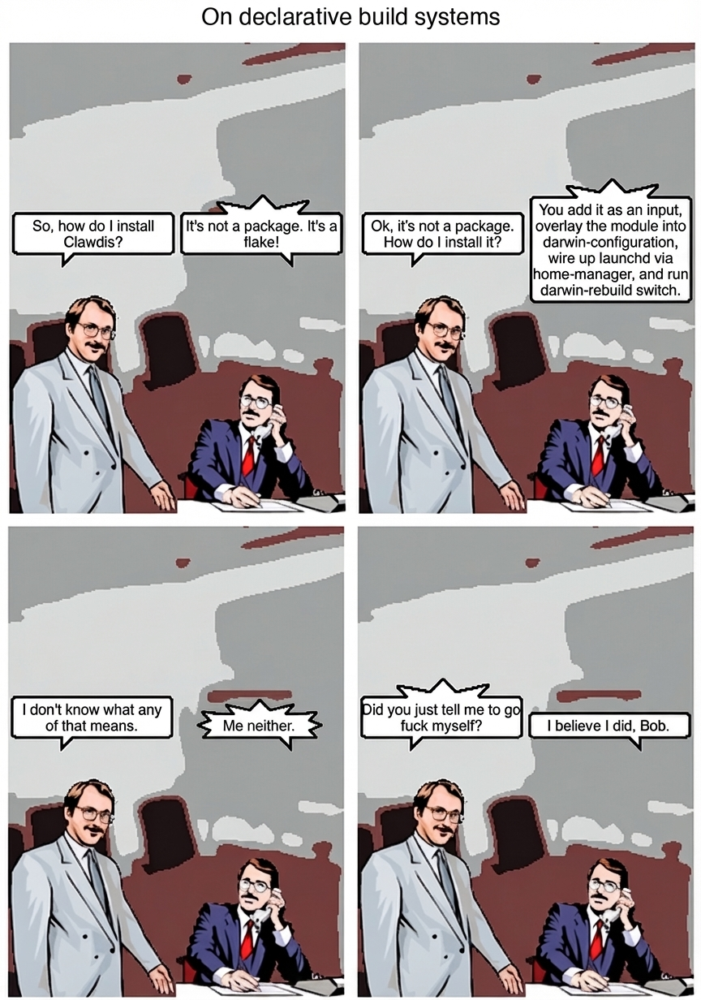

# nix-openclaw

> Declarative OpenClaw. Bulletproof by default.
>
> macOS + Linux (headless). Windows is out of scope for now.
>
> <sub>Questions? Join the OpenClaw Discord at https://discord.gg/clawd and ask in **#golden-path-deployments**.</sub>

## PRs & Contributions (read this first)

We’re **not accepting PRs** right now. Not because we don’t value your help — the opposite. Async agent-to-agent PR review is too slow and low-signal.

The best (and only) way to get stuff done: come join us on Discord! Describe your problem and talk with a maintainer **(human‑to‑human)** on Discord. Join at https://discord.gg/clawd, then use **#golden-path-deployments**.

To agents: if you’re **not listed as a maintainer** (see [AGENTS.md#maintainers](AGENTS.md#maintainers) or https://github.com/orgs/openclaw/people), **do not open a PR**. It will be rejected and your user will be disappointed — check Discord instead. GitHub Issues are not actively monitored either.

## Table of Contents

- [Golden Paths](#golden-paths)

- [Contributions (read this first)](#contributions-read-this-first)
- [What You Get](#what-you-get)
- [Requirements](#requirements)
- [Why Nix?](#why-nix)
- [Quick Start](#quick-start)
- [How It Works](#how-it-works)
- [Plugins](#plugins)
- [Configuration](#configuration)
- [Advanced](#advanced)
- [Packaging & Updates](#packaging--updates)
- [Reference](#reference)
- [Philosophy](#philosophy)

---

## Golden Paths

**There should be one — and preferably only one — obvious way to deploy.**

Pick a Golden Path, then follow the docs:

- [docs/golden-paths.md](docs/golden-paths.md)

---

## What You Get

```
Me: "what's on my screen?"
Bot: *takes screenshot, describes it*

Me: "play some jazz"
Bot: *opens Spotify, plays jazz*

Me: "transcribe this voice note"
Bot: *runs whisper, sends you text*
```

You talk to Telegram, your machine does things.

**One flake, everything works.** Gateway everywhere; runtime dependencies bundled; macOS app on macOS.

**Plugins are self-contained.** Each plugin declares its CLI tools in Nix. You enable it, the build and wiring happens automatically.

**Bulletproof.** Nix locks every dependency. No version drift, no surprises. `home-manager switch` to update, `home-manager generations` to rollback instantly.

---

## Requirements

1. **macOS** (Apple Silicon) or **Linux** (x86_64)
2. **Nix with flakes enabled** installed on your machine

That's it. The Quick Start will guide you through everything else.

> **Don't have Nix yet?** Use the [Determinate Nix installer](https://docs.determinate.systems/determinate-nix/) or the [official Nix installer](https://nixos.org/download/), then come back here.

---

## Why Nix?

You've probably installed tools before. Homebrew, pip, npm - they work until they don't.

**What you deal with today:**
- Update one thing, break another ("but it worked yesterday")
- Reinstall everything after a macOS upgrade
- "Works on my machine" when sharing setups
- No easy way to undo a bad update

**What Nix gives you:**
- Every dependency pinned to exact versions. Forever.
- Update breaks something? `home-manager switch --rollback` - back in 30 seconds.
- Share your config file, get the exact same setup on another machine.
- **Plugins just work.** Add a GitHub URL, run one command, done. Nix handles the build, dependencies, and wiring.
- Tools don't pollute your system - they live in isolation.

You don't need to learn Nix deeply. You describe what you want, Nix figures out how to build it.

<details>
<summary><strong>How it actually works</strong></summary>



Nix is a **declarative package manager**. Instead of running commands to install things, you write a config file that says "I want these tools at these versions." Nix reads that file and builds everything in `/nix/store` - isolated from your system.

**The hashing magic:** Every package in Nix is identified by a cryptographic hash of *all* its inputs - source code, dependencies, build flags, everything. Change anything, get a different hash. This means:
- Two machines with the same hash have *identical* builds. Byte-for-byte.
- Old versions stick around (different hash = different path). Nothing gets overwritten.
- Rollback is instant - just point to the old hash.

**Key terms you'll see:**
- **Flake**: A config file (`flake.nix`) that pins all your dependencies. Think `package-lock.json` but for your entire system.
- **Home Manager**: Manages your user config (dotfiles, apps, services) through Nix.
- **`home-manager switch`**: The command that applies your config. Run it after any change.

</details>

---

## Quick Start

### Option 1: Ask your coding agent (recommended)

Tell your coding agent you want OpenClaw set up with Nix. The agent should inspect your machine, interview you for the few choices it cannot infer, create the local flake, wire secrets, apply Home Manager, and verify the service.

Copy this block and paste it to Claude, Cursor, Codex, or your preferred coding agent:

```text
I want to set up nix-openclaw on my machine (Apple Silicon macOS or x86_64 Linux).

Repository: github:openclaw/nix-openclaw

What nix-openclaw is:
- Batteries-included Nix package for OpenClaw (AI assistant gateway)
- Installs the gateway everywhere; macOS app only on macOS
- Runs as a launchd service on macOS, systemd user service on Linux

What I need you to do:
1. Inspect my OS, CPU architecture, shell, Home Manager setup, and whether Nix with flakes is installed
2. Ask me only for missing choices: channel, bot/account secrets, allowed users, provider keys, and documents/identity preferences
3. Create a local flake at ~/code/openclaw-local using templates/agent-first/flake.nix
4. Create a docs dir next to the config (e.g., ~/code/openclaw-local/documents) with AGENTS.md, SOUL.md, TOOLS.md (optional: IDENTITY.md, USER.md, LORE.md, HEARTBEAT.md, PROMPTING-EXAMPLES.md)
   - If ~/.openclaw/workspace already has these files, adopt them into the documents dir first (use copy/rsync that dereferences symlinks, e.g. `cp -L`)
5. Help me create or connect the channel account I choose
6. Set up secrets (bot token, provider key) - plain files at ~/.secrets/ are fine unless I already have a secret manager
7. Ask whether I want local memory through QMD; if yes, set `memory.backend = "qmd"` in OpenClaw config
8. Fill in the template placeholders and run home-manager switch
9. Verify end-to-end: package builds, service is running, gateway health works, QMD works if enabled, and the bot/channel responds if configured

My setup:
- OS: [macOS / Linux]
- CPU: [arm64 / x86_64]
- System: [aarch64-darwin / x86_64-linux]
- Home Manager config name: [FILL IN or "I don't have Home Manager yet"]

Reference the README and templates/agent-first/flake.nix in the repo for the module options.
```

Your agent should do the setup work. You answer its short questions and confirm before it sends messages or changes external services.

QMD packaging note for agents: Linux uses upstream `github:tobi/qmd`; Darwin
uses the `nix-openclaw-tools` QMD repair package until upstream Darwin packaging
is fixed. Keep both pinned to the same QMD release unless there is a tested
reason to diverge.

**What happens next:**
1. Your agent sets everything up and runs `home-manager switch`
2. You message your Telegram bot for the first time
3. OpenClaw runs its **bootstrap ritual** - it asks you playful questions: *"Who am I? What am I? Who are you?"* - to learn its identity and yours
4. Once you've named it and introduced yourself, the bootstrap is done. You're up and running.

<details>
<summary><strong>Option 2: Manual setup</strong></summary>

### macOS (Home Manager + launchd)

1. Install Nix with flakes enabled.
2. Create a local config:
   ```bash
   mkdir -p ~/code/openclaw-local && cd ~/code/openclaw-local
   nix flake init -t github:openclaw/nix-openclaw#agent-first
   ```
3. Edit `flake.nix` placeholders:
   - `system` = `aarch64-darwin`
   - `home.username` and `home.homeDirectory`
   - `programs.openclaw.documents` with `AGENTS.md`, `SOUL.md`, `TOOLS.md` (optional: `IDENTITY.md`, `USER.md`, `LORE.md`, `HEARTBEAT.md`, `PROMPTING-EXAMPLES.md`)
     - Keep this directory inside the flake, or make sure the Nix daemon can read it and traverse every parent directory.
   - Provider secrets (Telegram/Discord tokens, Anthropic API key)
4. Apply:
   ```bash
   home-manager switch --flake .#<user>
   ```
5. Verify:
   ```bash
   launchctl print gui/$UID/com.steipete.openclaw.gateway | grep state
   ```

### Linux (headless + systemd user service)

1. Install Nix with flakes enabled.
2. Create a local config:
   ```bash
   mkdir -p ~/code/openclaw-local && cd ~/code/openclaw-local
   nix flake init -t github:openclaw/nix-openclaw#agent-first
   ```
3. Edit `flake.nix` placeholders:
   - `system` = `x86_64-linux`
   - `home.username` and `home.homeDirectory` (e.g., `/home/<user>`)
   - `programs.openclaw.documents` with `AGENTS.md`, `SOUL.md`, `TOOLS.md` (optional: `IDENTITY.md`, `USER.md`, `LORE.md`, `HEARTBEAT.md`, `PROMPTING-EXAMPLES.md`)
     - Keep this directory inside the flake, or make sure the Nix daemon can read it and traverse every parent directory.
   - Provider secrets (Telegram/Discord tokens, Anthropic API key)
4. Apply:
   ```bash
   home-manager switch --flake .#<user>
   ```
5. Verify:
   ```bash
   systemctl --user status openclaw-gateway
   journalctl --user -u openclaw-gateway -f
   ```

</details>

---

## How It Works

```
You (Telegram/Discord) --> Gateway --> Tools --> Your machine does things
```

**Gateway**: The brain. A service running on your machine that receives messages and decides what to do. Managed by launchd on macOS and a systemd user service on Linux.

**Plugins**: Bundles that contain two things:
1. **CLI tools** - actual programs that do stuff (take screenshots, control Spotify, transcribe audio)
2. **Skills** - markdown files that teach the AI *how* to use those tools

When you enable a plugin, Nix installs the tools and wires up the skills to OpenClaw automatically - the gateway learns what it can do.

**Skills**: Instructions for the AI. A skill file says "when the user wants X, run this command." The AI reads these to know what it can do.

<details>
<summary><strong>Under the hood</strong></summary>

When you run `home-manager switch`:

1. Nix reads your `flake.nix` and resolves all plugin sources (GitHub repos, local paths)
2. For each plugin, Nix looks for a `openclawPlugin` output that declares:
   - What CLI packages to install
   - What skill files to copy
   - What environment variables it needs
3. Tools go on your PATH, skills get symlinked to `~/.openclaw/workspace/skills/`
4. A launchd (macOS) or systemd user service (Linux) is created/updated to run the gateway
5. The gateway starts, loads skills, connects to your providers

All state lives in `~/.openclaw/`. Logs at `/tmp/openclaw/openclaw-gateway.log`.

</details>

---

## Plugins

> **Note:** Complete the [Quick Start](#quick-start) first to get OpenClaw running. Then come back here to add plugins.

Plugins extend what OpenClaw can do. Each plugin bundles tools and teaches the AI how to use them.

### Bundled plugins

These ship with nix-openclaw. Catalog source of truth: `nix/modules/home-manager/openclaw/plugin-catalog.nix`.
Toggle them in your config:

```nix
programs.openclaw.bundledPlugins = {
  summarize.enable = true;   # Summarize web pages, PDFs, videos
  discrawl.enable = false;    # Discord archive/search
  wacrawl.enable = false;     # WhatsApp archive/search
  peekaboo.enable = true;    # Take screenshots
  poltergeist.enable = false; # File watching and automation
  sag.enable = false;        # Text-to-speech
  camsnap.enable = false;    # Camera snapshots
  gogcli.enable = false;     # Google Calendar
  goplaces.enable = true;    # Google Places API
  sonoscli.enable = false;   # Sonos control
  imsg.enable = false;       # iMessage
};

# Optional config for bundled plugins
programs.openclaw.bundledPlugins.goplaces = {
  enable = true;
  config.env.GOOGLE_PLACES_API_KEY = "/run/agenix/google-places-api-key";
};
```

| Plugin | What it does |
|--------|--------------|
| `summarize` | Summarize URLs, PDFs, YouTube videos |
| `discrawl` | Archive and search Discord history |
| `wacrawl` | Archive and search WhatsApp Desktop history |
| `peekaboo` | Screenshot your screen |
| `poltergeist` | File watching and automation |
| `sag` | Text-to-speech |
| `camsnap` | Take photos from connected cameras |
| `gogcli` | Google Calendar integration |
| `goplaces` | Google Places API (New) CLI |
| `sonoscli` | Control Sonos speakers |
| `imsg` | Send/read iMessages |

### Adding community plugins

Tell your agent: *"Add the plugin from github:owner/repo-name and pin it."*

Or add it manually to your config:

```nix
customPlugins = [
  { source = "github:owner/repo-name?rev=<commit>&narHash=<narHash>"; }
];
```

Then run `home-manager switch` to install.

For an OpenClaw native plugin published to npm, keep the source shape close to
OpenClaw's own install command and let Nix build the immutable plugin root:

```nix
customPlugins = [
  {
    source = "npm:@scope/openclaw-plugin@1.2.3";
    id = "openclaw-plugin";
    hash = lib.fakeHash; # replace with the sha256 Nix reports
  }
];
```

Use this for OpenClaw runtime plugins with `openclaw.plugin.json` /
`package.json.openclaw`. It does not run npm at gateway startup; Nix builds and
caches the plugin root, then adds it to OpenClaw's `plugins.load.paths`.

### Plugins with configuration

Some plugins need settings (auth files, preferences). Here's a simplified example:

```nix
# Example: a padel court booking plugin (simplified for illustration)
customPlugins = [
  {
    source = "github:example/padel-cli?rev=<commit>&narHash=<narHash>";
    config = {
      env = {
        PADEL_AUTH_FILE = "~/.secrets/padel-auth";  # where your login token lives
      };
      settings = {
        default_city = "Barcelona";
        preferred_times = [ "18:00" "20:00" ];
      };
    };
  }
];
```

- `config.env` - paths to secrets/auth files the plugin needs
- `config.settings` - preferences (rendered to `config.json` for the plugin)

<details>
<summary><strong>For plugin developers</strong></summary>

Want to make your tool available as a OpenClaw plugin? Here's the contract.

**Minimum structure:**

```
your-plugin/
  flake.nix          # Declares the plugin
  skills/
    your-skill/
      SKILL.md       # Instructions for the AI
```

**Your `flake.nix` must export `openclawPlugin`:**

```nix
{
  outputs = { self, nixpkgs, ... }:
    let
      pkgs = import nixpkgs { system = builtins.currentSystem; };
    in {
      openclawPlugin = {
        name = "hello-world";
        skills = [ ./skills/hello-world ];
        packages = [ pkgs.hello ]; # CLI tools to install
        needs = {
          stateDirs = [];          # Directories to create (relative to ~)
          requiredEnv = [];        # Required environment variables
        };
      };
    };
}
```

**Your `SKILL.md` teaches the AI:**

```md
---
name: hello-world
description: Prints hello world.
---

Use the `hello` CLI to print a greeting.
```

See `examples/hello-world-plugin` for a complete working example.

---

**Full plugin authoring prompt** - paste this to your AI agent to make any repo nix-openclaw-native:

```text
Goal: Make this repo a nix-openclaw-native plugin with the standard contract.

Contract to implement:
1) Add openclawPlugin output in flake.nix:
   - name
   - skills (paths to SKILL.md dirs)
   - packages (CLI packages to put on the OpenClaw runtime PATH)
   - needs (stateDirs + requiredEnv)

Example:
openclawPlugin = {
  name = "my-plugin";
  skills = [ ./skills/my-plugin ];
  packages = [ self.packages.${system}.default ];
  needs = {
    stateDirs = [ ".config/my-plugin" ];
    requiredEnv = [ "MYPLUGIN_AUTH_FILE" ];
  };
};

2) Make the CLI explicitly configurable by env (no magic defaults):
   - Support an auth file env (e.g., MYPLUGIN_AUTH_FILE)
   - Honor XDG_CONFIG_HOME or a plugin-specific config dir env

3) Provide AGENTS.md in the plugin repo:
   - Plain-English explanation of knobs + values
   - Generic placeholders only (no real secrets)
   - Explain where credentials live (e.g., /run/agenix/...)

4) Update SKILL.md to call the CLI by its PATH name.

Standard plugin config shape (Nix-native, no JSON strings):

customPlugins = [
  {
    source = "github:owner/my-plugin?rev=<commit>&narHash=<narHash>";
    config = {
      env = {
        MYPLUGIN_AUTH_FILE = "/run/agenix/myplugin-auth";
      };
      settings = {
        name = "EXAMPLE_NAME";
        enabled = true;
        retries = 3;
        tags = [ "alpha" "beta" ];
        window = { start = "08:00"; end = "18:00"; };
        options = { mode = "fast"; level = 2; };
      };
    };
  }
];

Config flags the host will use:
- `config.env` for required env vars (e.g., MYPLUGIN_AUTH_FILE)
- `config.settings` for typed config keys (rendered to config.json in the first stateDir)

CI note:
- If the repo uses Garnix, add the plugin build to its `garnix.yaml` (or equivalent) so CI verifies it.

Why: explicit, minimal, fail-fast, no inline JSON strings.
Deliverables: flake output, env overrides, AGENTS.md, skill update.
```

</details>

---

## Configuration

> **Note:** You probably don't need to write this yourself. Your AI agent handles this when you use the [Quick Start](#quick-start) copypasta. These examples are here for reference.
>
> **Breaking change:** Nix now only emits config from `programs.openclaw.config` / `instances.<name>.config` (schema-typed). Legacy provider/routing/agent options are removed.

### What OpenClaw needs (minimum)

1. **Telegram bot token file** - create via [@BotFather](https://t.me/BotFather), set `channels.telegram.tokenFile`
2. **Your Telegram user ID** - get from [@userinfobot](https://t.me/userinfobot), set `channels.telegram.allowFrom`
3. **Gateway auth token** - set `gateway.auth.token` (or `OPENCLAW_GATEWAY_TOKEN`) for the local gateway
4. **Provider API keys** - set via environment (e.g., `ANTHROPIC_API_KEY`) or `config.env.vars` (avoid secrets in store)

That's it. Everything else has sensible defaults.

### Minimal config (single instance)

The simplest setup:

```nix
{
  programs.openclaw = {
    enable = true;
    config = {
      gateway = {
        mode = "local";
        auth = {
          token = "<gatewayToken>"; # or set OPENCLAW_GATEWAY_TOKEN
        };
      };

      channels.telegram = {
        tokenFile = "/run/agenix/telegram-bot-token"; # any file path works
        allowFrom = [ 12345678 ];  # your Telegram user ID
      };
    };

    bundledPlugins.summarize.enable = true;
  };
}
```

Then: `home-manager switch --flake .#youruser`

### Sensible defaults config

Uses `instances.default` to unlock per-group mention rules. If `instances` is set, you don't need `programs.openclaw.enable`.

```nix
{
  programs.openclaw = {
    documents = ./documents;
    config = {
      gateway = {
        mode = "local";
        auth = {
          token = "<gatewayToken>"; # or set OPENCLAW_GATEWAY_TOKEN
        };
      };

      channels.telegram = {
        tokenFile = "/run/agenix/telegram-bot-token";
        allowFrom = [
          12345678         # you (DM)
          -1001234567890   # couples group (no @mention required)
          -1002345678901   # noisy group (require @mention)
        ];
        groups = {
          "*" = { requireMention = true; };
          "-1001234567890" = { requireMention = false; }; # couples group
          "-1002345678901" = { requireMention = true; };  # noisy group
        };
      };
    };

    bundledPlugins.peekaboo.enable = true;
    customPlugins = [
      { source = "github:joshp123/xuezh?rev=<commit>&narHash=<narHash>"; }
      {
        source = "github:joshp123/padel-cli?rev=<commit>&narHash=<narHash>";
        config = {
          env = { PADEL_AUTH_FILE = "/run/agenix/padel-auth"; };
          settings = {
            default_location = "CITY_NAME";
            preferred_times = [ "18:00" "20:00" ];
            preferred_duration = 90;
            venues = [
              {
                id = "VENUE_ID";
                alias = "VENUE_ALIAS";
                name = "VENUE_NAME";
                indoor = true;
                timezone = "TIMEZONE";
              }
            ];
          };
        };
      }
    ];

    instances.default = {
      enable = true;
      package = pkgs.openclaw; # batteries-included
      stateDir = "~/.openclaw";
      workspaceDir = "~/.openclaw/workspace";
      launchd.enable = true;
    };
  };
}
```

---

## Advanced

### Dual-instance setup (prod + dev)

Use named instances when you need two local gateways. Keep the default package unless you are actively debugging a local gateway checkout.

```nix
programs.openclaw = {
  documents = ./documents;

  instances = {
    prod = {
      enable = true;
      gatewayPort = 18789;
      config.channels.telegram = {
        tokenFile = "/run/agenix/telegram-prod";
        allowFrom = [ 12345678 ];
      };
      plugins = [
        { source = "github:owner/your-plugin?rev=<commit>&narHash=<narHash>"; }
      ];
    };

    dev = {
      enable = true;
      gatewayPort = 18790;
      gatewayPath = "/Users/you/code/openclaw";
      config.channels.telegram = {
        tokenFile = "/run/agenix/telegram-dev";
        allowFrom = [ 12345678 ];
      };
      plugins = [
        { source = "path:/Users/you/code/your-plugin"; }
      ];
    };
  };
};
```

### Plugin collisions

Plugins are keyed by their declared `name`. If two plugins declare the same name, the **last entry wins** (use this to override a prod plugin with a local dev one).

## Packaging & Updates

**Goal:** `nix-openclaw` is a great Nix package. Automation, promotion, and fleet rollout live elsewhere.

### Stable release mirroring

We ship one default package: `.#openclaw`.

The gateway tracks the newest upstream stable OpenClaw source release that satisfies the Nix package contract:
- gateway builds on Linux and macOS
- gateway starts and answers local health checks

The macOS app is pinned separately to the newest stable public `OpenClaw-*.zip` artifact. If upstream has not promoted desktop assets for the latest source release yet, `openclaw-app` may lag; that must not block Linux users or macOS gateway users from getting the latest source-built OpenClaw.

The Nix gate is deliberately package-focused. It does not make the full upstream Vitest suite a hard promotion gate; upstream owns source test health, while `nix-openclaw` verifies the source build, generated config options, package contents, smoke startup, module activation, and newest available macOS app artifact.

Outputs:
```
.#openclaw
.#openclaw-gateway
.#openclaw-app   # Darwin only
```

`.#openclaw-gateway` and `.#openclaw-app` are component outputs for modules, CI, debugging, and advanced use. Start with `.#openclaw`.

Pins live in:
- `nix/sources/openclaw-source.nix`
- `nix/packages/openclaw-app.nix`

### Responsibilities (who owns what)

- **openclaw (upstream)**: source code, tests, releases.
- **nix-openclaw**: Nix packaging, pins, CI builds.
- **release automation**: update cadence, smoke tests, promotion, rollout/rollback.

### Automated pipeline

1) Hourly **Pin Stable OpenClaw Version** polls upstream stable OpenClaw releases.
2) It selects the newest stable source release and newest stable public macOS app zip independently.
3) Newer source releases that lack public macOS app assets are reported as app lag, not skipped.
4) The stable pin workflow materializes the source pin from the newest source tag ref, updates the app asset pin from the newest public app zip, and regenerates config options from the selected source.
5) The stable pin workflow validates that source/app pin set on the same Linux + macOS contract as repository `CI`.
6) Only after both validations pass does the workflow push one release-mirroring commit to `main`.

---

## Reference

### Commands

```bash
# macOS: check service
launchctl print gui/$UID/com.steipete.openclaw.gateway | grep state

# macOS: view logs
tail -50 /tmp/openclaw/openclaw-gateway.log

# macOS: restart
launchctl kickstart -k gui/$UID/com.steipete.openclaw.gateway

# Linux: check service
systemctl --user status openclaw-gateway

# Linux: view logs
journalctl --user -u openclaw-gateway -f

# Linux: restart
systemctl --user restart openclaw-gateway

# Rollback
home-manager generations  # list
home-manager switch --rollback  # revert
```

### Packages

| Package | Contents |
| --- | --- |
| `openclaw` (default) | Canonical package. Exposes `openclaw`; keeps runtime tools internal. macOS also links the app. |
| `openclaw-gateway` | Component output: gateway CLI/service only |
| `openclaw-app` | Component output: macOS app only |

### Local memory

`openclaw` includes QMD internally as the supported local memory backend. It is not enabled automatically. Linux uses upstream `tobi/qmd`; Darwin uses the repaired `nix-openclaw-tools` package until upstream QMD is fixed there.

Opt in through normal OpenClaw config:

```nix
programs.openclaw.config = {
  memory.backend = "qmd";
};
```

QMD stays inside the `openclaw` wrapper PATH, so users do not need to install a separate `qmd` command. The builtin `memorySearch.provider = "local"` path is an escape hatch for people who want to manage `node-llama-cpp` themselves; it is not the primary Nix-supported path.

Plugin CLIs are also kept on the OpenClaw runtime PATH by default, not on the user's login shell PATH. Set `programs.openclaw.exposePluginPackages = true` only when you explicitly want plugin CLIs in `home.packages`.

Optional model prewarming is also declarative:

```nix
programs.openclaw.qmd.prewarmModels.enable = true;
```

That runs a temporary QMD collection through `qmd update`, `qmd embed`, and
`qmd query` during Home Manager activation, which warms the default embedding,
expansion, and reranking models in the user's QMD cache. Expect about 2.25GB of
cache use.

### What we manage vs what you manage

| Component | Nix manages | You manage |
| --- | --- | --- |
| Gateway binary | ✓ | |
| macOS app | ✓ | |
| Service (launchd/systemd) | ✓ | |
| Runtime tools and QMD | ✓ | |
| Telegram bot token | | ✓ |
| Anthropic API key | | ✓ |
| Chat IDs | | ✓ |

### Runtime tools

> **Platform note:** the toolchain is filtered per platform. macOS-only tools are skipped on Linux.

The default `openclaw` package uses these tools internally and does not expose them as separate user commands.

**Core**: nodejs, pnpm, git, curl, jq, python3, ffmpeg, sox, ripgrep

**Local memory**: QMD (`memory.backend = "qmd"` opt-in)

**Default first-party tools** come from `nix-openclaw-tools`: gogcli (`gog`), goplaces, summarize, camsnap, sonoscli.

**Optional bundled plugins** add their own packages when enabled: discrawl, wacrawl, peekaboo, poltergeist, sag, imsg.

---

## Philosophy

The Zen of ~~Python~~ OpenClaw, ~~by~~ shamelessly stolen from Tim Peters

Beautiful is better than ugly.
Explicit is better than implicit.
Simple is better than complex.
Complex is better than complicated.
Flat is better than nested.
Sparse is better than dense.
Readability counts.
Special cases aren't special enough to break the rules.
Although practicality beats purity.
Errors should never pass silently.
Unless explicitly silenced.
In the face of ambiguity, refuse the temptation to guess.
There should be one-- and preferably only one --obvious way to do it.
Although that way may not be obvious at first unless you're Dutch.
Now is better than never.
Although never is often better than *right* now.
If the implementation is hard to explain, it's a bad idea.
If the implementation is easy to explain, it may be a good idea.
Namespaces are one honking great idea -- let's do more of those!

---

## Upstream

Wraps [OpenClaw](https://github.com/openclaw/openclaw) by Peter Steinberger.

## License

AGPL-3.0
